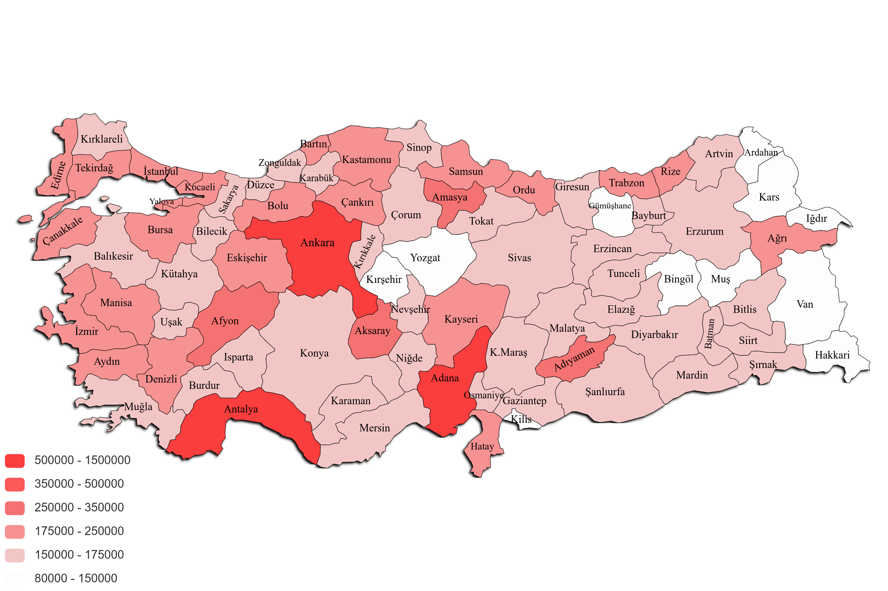

# Distributed City Sentiment

City-level sentiment analysis of Turkish tweets. The same classifier is timed twice: once tweet by tweet, and once through Apache Spark.

Muhammed Said Zengin and Rabia Arslan did this work at TOBB University of Economics and Technology. Commits in this repository run from 6 November 2021 through 19 December 2021.

## What it does

The recorded dataset has 16,116,035 tweets from 81 provinces. A Turkish BERT classifier, loaded with `ktrain`, labels each tweet positive or negative. `code/baseline.py` predicts the first 10,000 lines of each city file one by one. `code/distributed.py` loads those same lines into a Spark DataFrame, repartitions by the machine's CPU count, and predicts with a Spark UDF.

The paper and the slides are in Turkish:

- `makale.pdf` — paper
- `sunum.pdf` — presentation

## What is missing

The tweet files and the trained model are not in this repository. `.gitignore` leaves `*.txt` and the contents of `model/` untracked. `data/README.md` and `model/README.md` used to point at Google Drive downloads. Both pages returned "not found" on 3 October 2026. Nothing else in the repository replaces them.

There is no `requirements.txt` and no test suite. The scripts import `ktrain` and `pyspark`. The Spark script also imports `pandas`. No package versions are recorded here.

Each city file must contain at least 10,000 lines. The scripts read the first 10,000 lines with `next()` and raise `StopIteration` when a file is shorter. Start them from `code/`. The paths `../data/*.txt` and `../model` are relative to that directory. Both scripts create a Spark session and load the model as soon as they are imported.

## How to run

1. Install Python packages that provide `ktrain`, `pyspark`, and `pandas`, and a local Spark setup that `SparkSession.builder.getOrCreate()` can start.
2. Put the `ktrain` predictor directory at `model/`, so `ktrain.load_predictor("../model")` succeeds from `code/`.
3. Put one text file per city in `data/`. The name before `.txt` is the city name. One tweet per line.
4. From `code/`:

```bash
python baseline.py
python distributed.py
```

`baseline.py` prints how long sequential prediction took. `distributed.py` prints the partition count, shows each city's prediction table, and then prints how long the run took. The partition count is `multiprocessing.cpu_count()`. It is not a command-line argument.

## Recorded timing

The numbers below are the ones already written in this repository. The paper's timing table is labeled in seconds. Its 10,000-tweet column matches this table. Its 50,000-tweet column does not: the paper lists 3,256 seconds for one partition, and this file lists 5,782.

| Partitions | 10,000 tweets | 50,000 tweets |
| --- | --- | --- |
| 1 | 621 | 5782 |
| 2 | 342 | 2703 |
| 4 | 223 | 1386 |
| 8 | 100 | 701 |
| 16 | 57 | 352 |
| 32 | 38 | 182 |
| 64 | 35 | 99 |
| 128 | 23 | 58 |
| 256 | 22 | 39 |
| 512 | 21 | 28 |
| 1024 | 19 | 24 |

| Partitions | 16,116,035 tweets |
| --- | --- |
| 1 | 1,093,560 seconds |
| 1024 | 2,282 seconds |

The full-data Spark figure is the sum of per-city runs. The paper says predicting all 16 million tweets as one Spark job was not finished on the server they used.

## Sentiment map

The heatmap is the recorded city-level result. The paper says these scores used a random 10,000 tweets from each province, and that Bitlis was the most positive province and Aydın the most negative.


