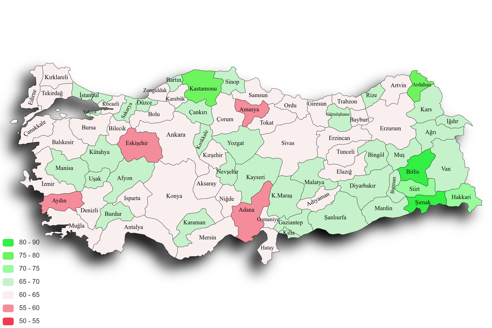

### Distributed City Sentiment
### Şehir Bazlı Dağıtık Duygu Analizi

# Hızlandırma Sonuçları
| Partition Sayısı | 10.000 Veri | 50.000 Veri |
| ---------------- | ----------- | ----------- |
| 1                |  621        |  5782       |
| 2                |  342        | 2703        |
| 4                | 223         | 1386        |
| 8                | 100         | 701         |
| 16               | 57          | 352         |
| 32               | 38          | 182         |
| 64               | 35          | 99          |
| 128              | 23          | 58          |
| 256              | 22          | 39          |
| 512              | 21          | 28          |
| 1024             | 19          | 24          |

| Partition Sayısı | 16.116.035 Veri |
| ---------------- | ----------- |
| 1                | 1.093.560 saniye |
| 1024             |  2282 saniye |

# Duygu Analiz Sonuçları

