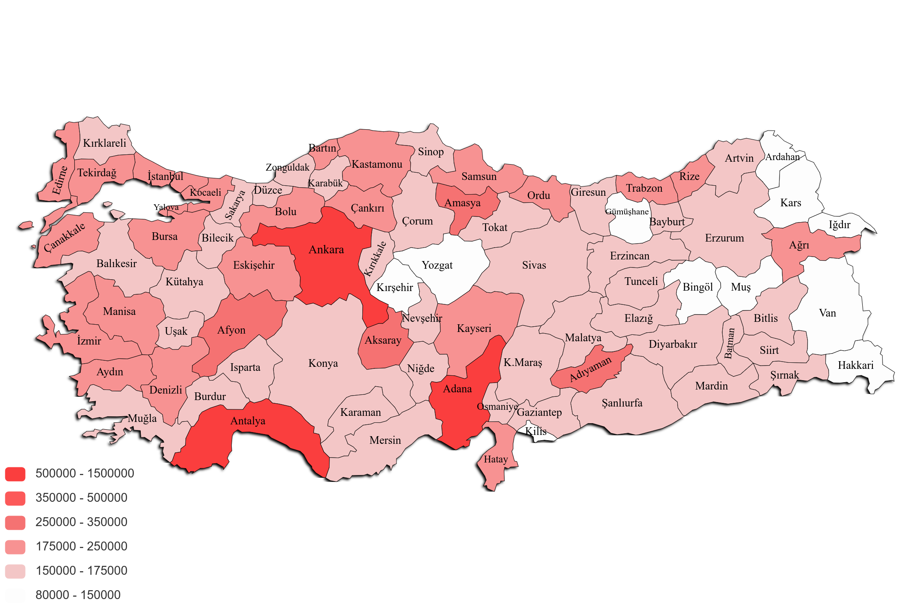

You can download 16.1 million data for 81 provinces from [this link.](https://drive.google.com/file/d/1LJ8pdsKdu2rQUrcGRRyWxlTYMPczLwZl/view?usp=sharing)

| Şehir          |  Tweet Sayısı |
| -------------- | ------------- |
| Adana          | 754922        |
| Adıyaman       | 324034        |
| Afyonkarahisar | 337301        |
| Ağrı           | 175573        |
| Aksaray        | 305239        |
| Amasya         | 250350        |
| Ankara         | 1054767       |
| Antalya        | 888494        |
| Ardahan        | 88390         |
| Artvin         | 155056        |
| Aydın          | 179194        |
| Balıkesir      | 174962        |
| Bartın         | 175027        |
| Batman         | 152618        |
| Bayburt        | 154106        |
| Bilecik        | 153412        |
| Bingöl         | 124883        |
| Bitlis         | 164351        |
| Bolu           | 176681        |
| Burdur         | 162017        |
| Bursa          | 188502        |
| Çanakkale      | 191517        |
| Çankırı        | 203021        |
| Çorum          | 159380        |
| Denizli        | 180426        |
| Diyarbakır     | 154140        |
| Düzce          | 171285        |
| Edirne         | 189467        |
| Elazığ         | 166779        |
| Erzincan       | 165682        |
| Erzurum        | 155764        |
| Eskişehir      | 196189        |
| Gaziantep      | 170970        |
| Giresun        | 164283        |
| Gümüşhane      | 118561        |
| Hakkari        | 118727        |
| Hatay          | 176004        |
| Iğdır          | 132836        |
| Isparta        | 156393        |
| İstanbul       | 222137        |
| İzmir          | 206820        |
| Kahramanmaraş  | 160972        |
| Karabük        | 165247        |
| Karaman        | 154118        |
| Kars           | 141955        |
| Kastamonu      | 202311        |
| Kayseri        | 179373        |
| Kırıkkale      | 157763        |
| Kırklareli     | 166062        |
| Kırşehir       | 145177        |
| Kilis          | 138311        |
| Kocaeli        | 184651        |
| Konya          | 169324        |
| Kütahya        | 159605        |
| Malatya        | 172500        |
| Manisa         | 178634        |
| Mardin         | 154912        |
| Mersin         | 172327        |
| Muğla          | 174975        |
| Muş            | 123740        |
| Nevşehir       | 168445        |
| Niğde          | 157988        |
| Ordu           | 175115        |
| Osmaniye       | 158027        |
| Rize           | 184130        |
| Sakarya        | 173399        |
| Samsun         | 187747        |
| Siirt          | 162174        |
| Sinop          | 155254        |
| Sivas          | 163256        |
| Şanlıurfa      | 165453        |
| Şırnak         | 152283        |
| Tekirdağ       | 176874        |
| Tokat          | 163623        |
| Trabzon        | 192104        |
| Tunceli        | 155569        |
| Uşak           | 150583        |
| Van            | 147715        |
| Yalova         | 178279        |
| Yozgat         | 147090        |
| Zonguldak      | 158710        |
| -------------- | ------------- |
| Toplam         | 16116035      |